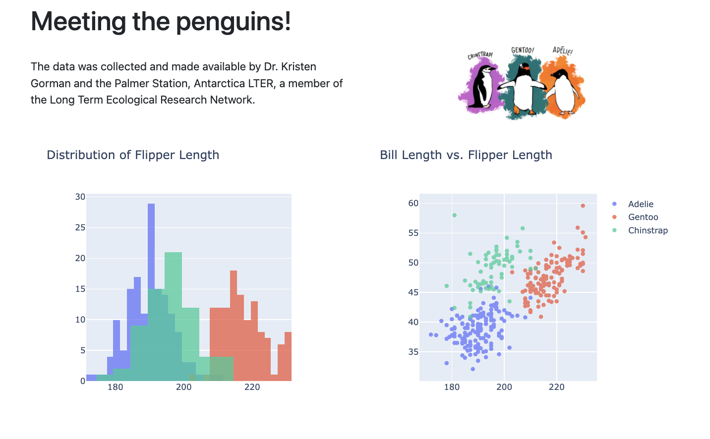

# demo-dash-penguins



<https://colorado.rstudio.com/rsc/demo-dash-penguins/>

# Usage

Create a new virtual environment:

```bash
python -m venv .vev
```

Activate the environment:

```
source .venv/bin/activate
pip install --upgrade pip wheel
pip install -r app/requirements.txt
```

Run the app:

```bash
python app/app.py
```

## Deployment

```bash
rsconnect write-manifest dash \
  --overwrite \
  --python .venv/bin/python \
  --entrypoint app \
  app
```